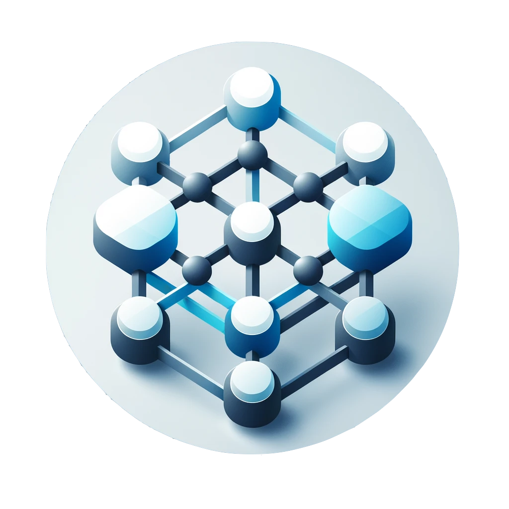
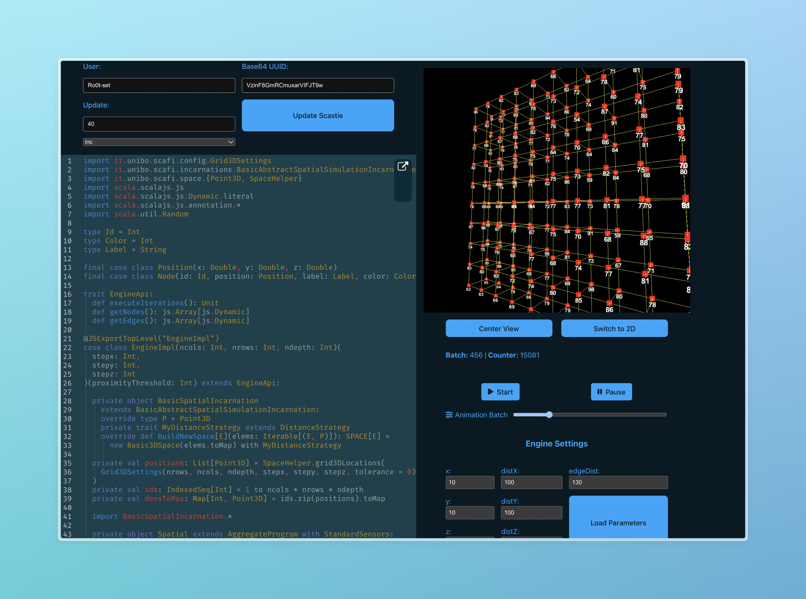
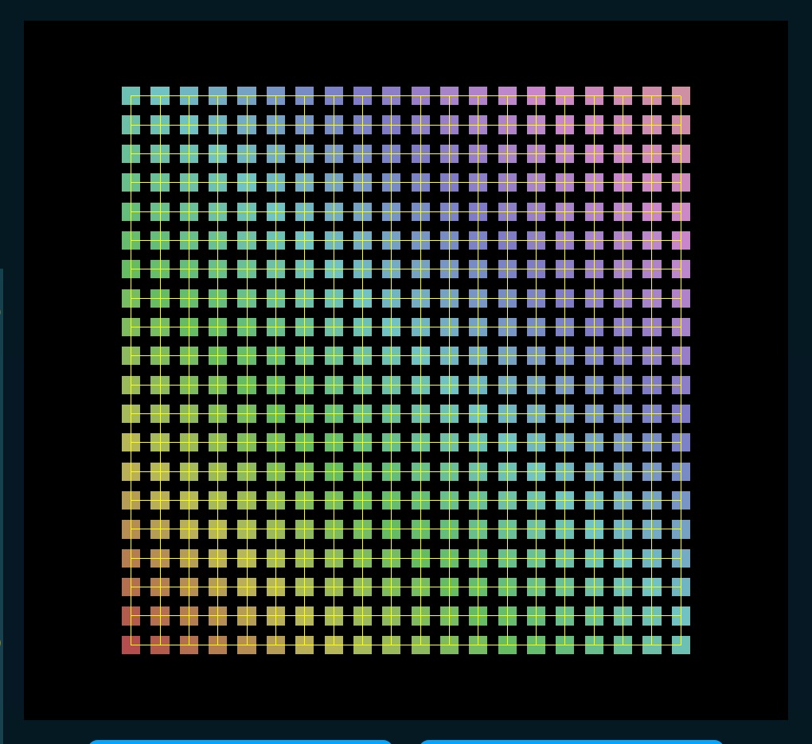
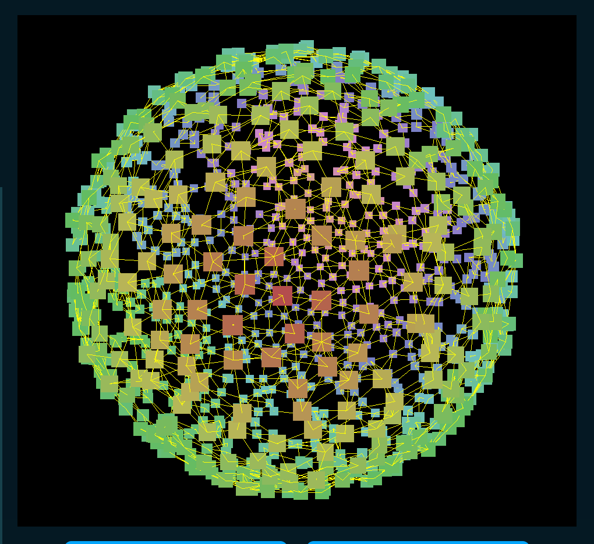

# Scafi Web 3D




[](https://github.com/Ro0t-set/PPS-24-ScafiWeb3/actions/workflows/pages.yml)
---

**Access the official documentation**:  
👉 [Scafi Web 3D Docs](https://www.tommasopatriti.me/PPS-24-ScafiWeb3/) 👈

---

## How to Run the Project

```bash
git clone https://github.com/Ro0t-set/PPS-24-ScafiWeb3.git
cd PPS-24-ScafiWeb3
cd js && npm install && cd ..
npm install
sbt fastLinkJS
npm run dev
```

---

## sbt Tests

- `sbt test`
- `sbt cucumber -DtestEnv=<local, ci> -Dbrowser=<edge, firefox, chrome>`  
  *(Default: `ci` and `firefox`)*
- `sbt cucumberWithServer` *(Uses `ci` and `firefox` by default)*

---

## npm Commands

- `npm install` — Install dependencies.
- `npm run dev` — Run the project in development mode.
- `npm run build` — Build the production version of the project.
- `npm run docs:dev` — Serve the documentation in development mode.
- `npm run docs:build` — Build the documentation for production.

---

## Example Screenshots

- **Main Interface**  
  

- **Gradient Effect**  
  

- **Sphere Visualization**  
  

