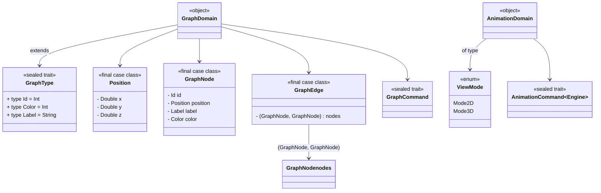

# Requisiti

## Buisness

L'applicazione deve permettere di caricare un programma aggregato, visualizzarlo in un grafo 3D e permettere di eseguirlo. La compilazione del programma deve avvenire runtime, utilizzando un server esterno.

## Vocabolario e Concetti

- **Programma Aggregato**: un programma aggregato è un programma distribuito che viene eseguito su un insieme di dispositivi che comunicano tra di loro. Ogni dispositivo esegue lo stesso programma, ma con vicini e parametri diversi.
- **Grafo**: un grafo è una struttura dati composta da nodi e archi, dove i nodi rappresentano i dispositivi e gli archi le comunicazioni tra di essi.
- **Nodo**: un nodo è un dispositivo che esegue un programma aggregato.
- **Arco**: un arco è una comunicazione tra due nodi.
- **Player**: il player è un componente che permette di controllare l'esecuzione del programma aggregato.
- **Velocità della Simulazione**: la velocità della simulazione è la velocità con cui il player esegue il programma aggregato.
- **Parametri del Grafo**: i parametri del grafo sono le caratteristiche del grafo iniziale, come il numero di nodi, il raggio di visibilità e la loro disposizione.
- **Boilerplate**: il boilerplate è il codice necessario per compilare il programma aggregato e farlo interagire con il grafo.

## Modello di dominio

Il dominio è diviso in due parti principali: il grafo e l'animazione:

- Il grafo è composto da nodi e archi, dove i nodi rappresentano i dispositivi e gli archi le comunicazioni tra di essi.

- L'animazione è composta da comandi che permettono di controllare una qualsiasi tipologia di processo che può essere eseguito a step.

## Funzionali

### Utente

1. L'utente deve poter caricare di un programma aggregato.
2. L'utente deve poter visualizzare il grafo generato in 3d,
3. L'utente deve poter controllare l'esecuzione del programma aggregato.
4. L'utente deve poter decidere le dimensioni del grafo.
5. L'utente deve poter interagire con l'applicazione tramite un'interfaccia grafica disponibile online.
6. L'utente deve poter modificare i parametri del grafo iniziale.
7. L'utente deve poter cambiare la visualizzazione del grafo da 3D a 2D.
8. L'utente deve poter cambiare il colore dei nodi.
9. L'utente deve poter scegliere tra una serie d'esempi di programmi aggregati predefiniti.

### Sistema

1. Utilizzo di *Scastie* per la compilazione del programma aggregato.
2. Possibilità di caricare codice direttamente dal proprio account *Scastie*.
3. Visualizzatore 3D del grafo generato.
4. Player per la gestione del grafo con funzioni di *Play*, *Pausa* e regolazione della velocità della simulazione.
5. Possibilità di modificare i parametri del grafo iniziale come numero di nodi, il raggio di visibilità e la loro disposizione.
6. Inclusione di vari esempi di programmi aggregati.
7. Il grafo deve supportare più di 30 aggiornamenti al secondo.

## Non funzionali

1. Affidabilità: l'applicazione deve essere stabile, evitando crash.
2. Documentazione: l'intero progetto deve essere ben documentato, in modo da facilitare la comprensione del codice.
3. Performance: l'applicazione deve essere veloce e reattiva, evitando prolungate attese per l'utente nello svolgimento delle azioni.
4. Portabilità: l'applicazione deve essere disponibile su più piattaforme.
5. Manutenibilità: il codice deve essere ben strutturato e facilmente manutenibile.

## Requisiti Opzionali

1. Possibilità di centrare il grafo.
2. Possibilità di cambiare il colore dei nodi.
3. Nascondere il boilerplate Scastie.
4. Cambiare la visualizzazione da 3D a 2D, eliminando quindi la possibilità di ruotare la camera.

## Tecnologie ed Implementazione

### Ambiente

- Scala 3.3.4
- ScalaJS 1.18.x
- JDK 21+

### Librerie Principali

- Laminar 1.17.x

### Testing

- Cucumber 8.25.x
- MUnit 1.0.x
- Selenium 4.1.x

### Compilazione del Programma Aggregato

- Scastie (embedded)

### Formattazione e Qualità

- Scalafmt 2.5.x
- Scalafix 0.14.x
- Wartremover 3.2.x

### CI/CD

- GitHub Actions

### Documentazione e Deployment

- vite 6.x.x
- vitepress 1.x.x
