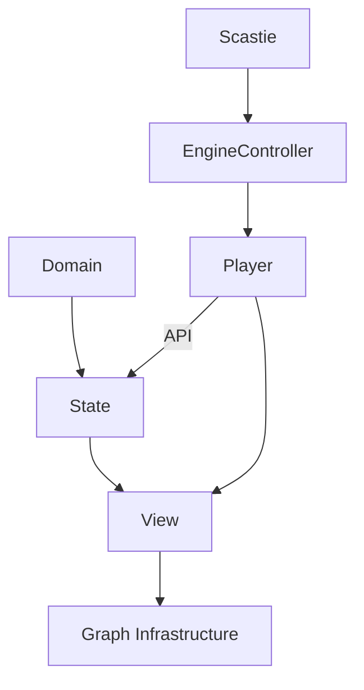

# Architettura

## Livelli

- **Domain**: Contiene la logica e i concetti fondamentali del sistema
- **State**: Si occupa di gestire lo stato dell'applicazione e le sue transizioni.
- **View**: Gestisce la presentazione dei dati e l'interazione con l'utente.
- **Infrastructure**: Rappresenta la parte tecnica o di supporto, come il rendering 3D o l'integrazione con librerie esterne.

## Pattenr Architetturali

- **Layered Architecture**: Chiara separazione tra logica del dominio, gestione dello stato e presentazione.
- **Component-Based Design**: La view è composta da piccoli moduli riutilizzabilie
- **Adapter Pattern**: Utilizzato per adattare librerie esterne al contesto del progetto