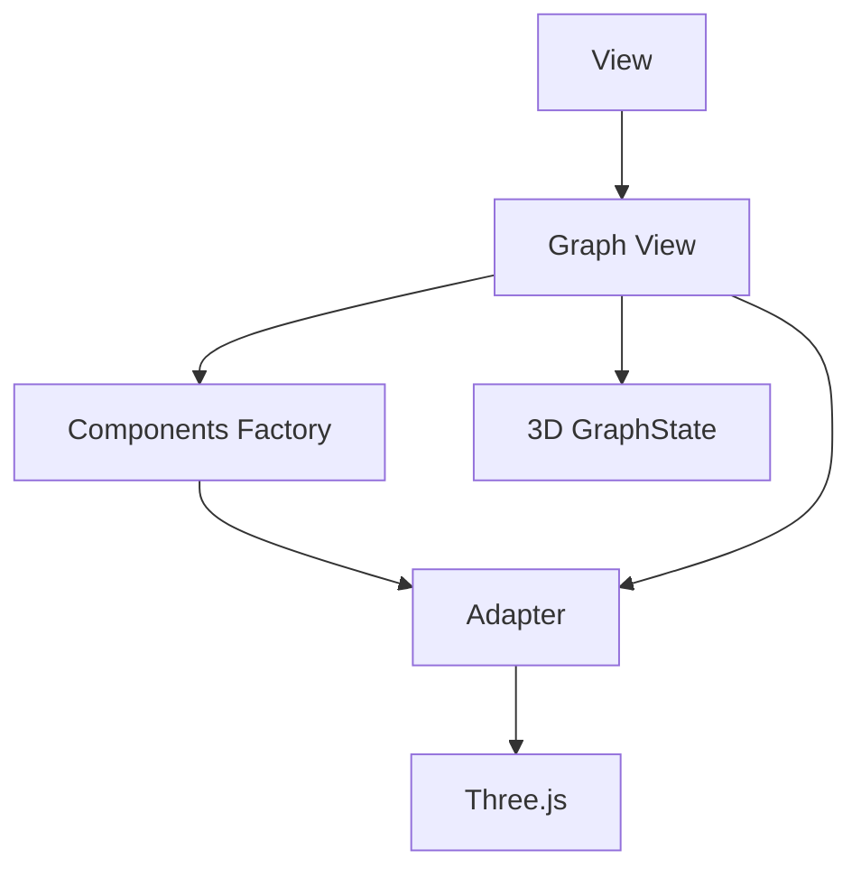

# Architettura

## Livelli

- **Domain**: Contiene la logica di business e i concetti fondamentali (core model) del sistema. È la parte “pura” dell’applicazione, priva di dipendenze da framework o librerie specifiche.

- **State**: Si occupa di gestire lo stato dell’applicazione e le sue transizioni. Contiene il meccanismo che tiene traccia delle modifiche al dominio ed espone operazioni per aggiornare lo stato.

- **View**: Si basa su un design a componenti, ovvero su piccoli moduli (UI Components) che si occupano ciascuno di una parte di interfaccia. Gestisce la presentazione dei dati e l’interazione con l’utente.

- **Graph Infrastructure**: Si occupa di gestire la visualizzazione del grafo 3D. Include la logica per la rappresentazione e la manipolazione del grafo, e la comunicazione con la libreria Three.js.

## Architettura Generale

## Architettura del Grafo 3D

## Principali Pattenr Architetturali

- **Component-Based Design**: La View è organizzata in componenti riutilizzabili, ognuno responsabile di un aspetto specifico dell’interfaccia. Questo semplifica la manutenzione e promuove la riusabilità.

- **Adapter Pattern**: Utilizzato principalmente nella Graph Infrastructure per adattare librerie o API esterne al modello e alle interfacce dell’applicazione, mantenendo l’applicazione (Domain/State/View) indipendente dai dettagli di implementazione.
