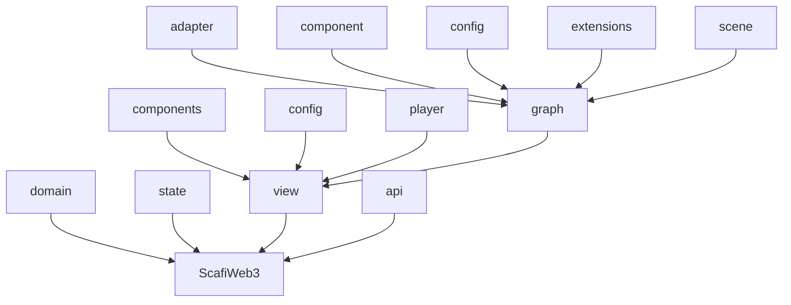
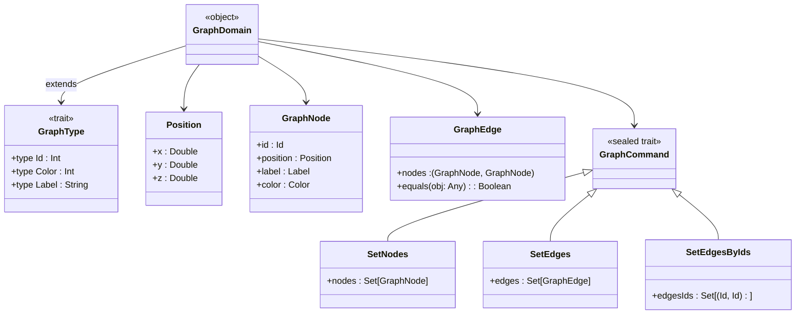
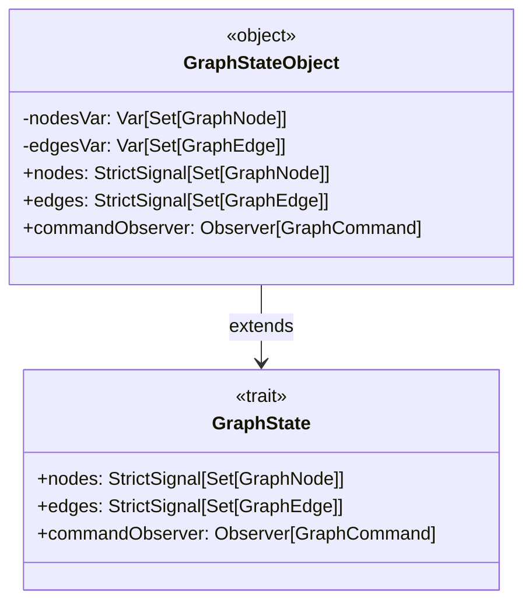
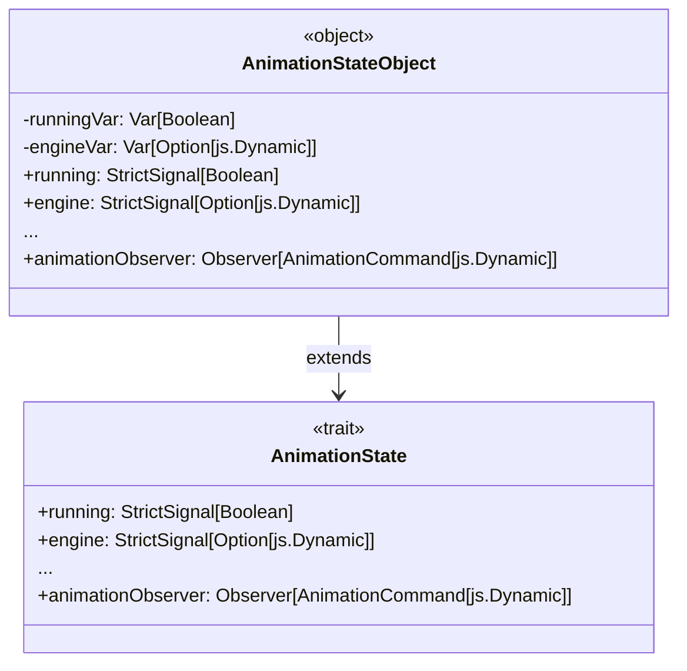
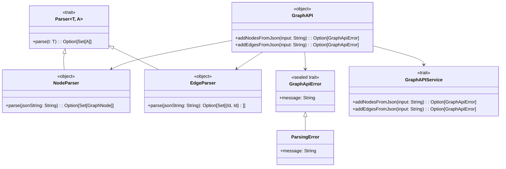
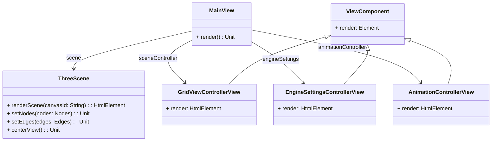
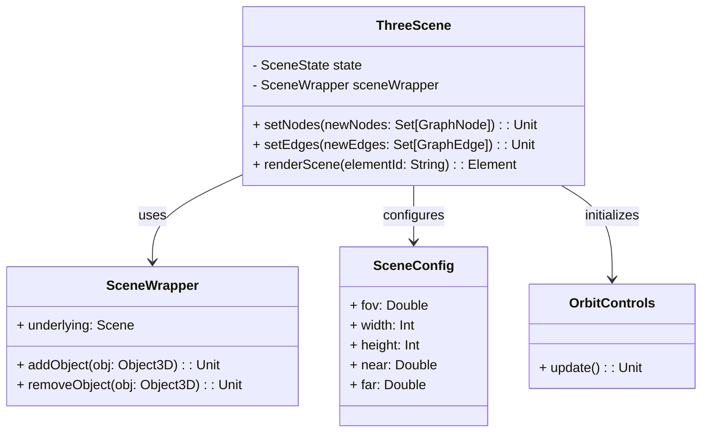

# Organizzazione del codice

- **`domain`**: Rappresenta il cuore della logica applicativa, modellando i concetti fondamentali del sistema.

- **`state`**: Si occupa della gestione dello stato dell'applicazione e delle sue transizioni. Questo package suggerisce l'uso di un approccio reattivo, dove lo stato è centrale e gli aggiornamenti vengono propagati automaticamente.

- **`view`**: Si concentra sulla presentazione e l'interazione con l'utente. La suddivisione in sottopackage rende evidente l'uso del **Component-Based Design**, dove ogni componente ha una responsabilità specifica. Questo favorisce il riuso e la manutenibilità del codice.

- **`api`**: Definisce le interfacce e i parser per comunicare con l'esterno.

## Dettagli del package `view`

Il package `view` è ulteriormente suddiviso in:

- **`components`**: Contiene componenti grafici riutilizzabili, seguendo un approccio modulare.

- **`config`**: Gestisce le configurazioni necessarie per personalizzare e parametrizzare l'applicazione.

- **`player`**: Include il player per gestire l'esecuzione del grafo, con funzionalità di *Play*, *Pausa* e regolazione della velocità.

- **`graph`**: Contiene il visualizzatore 3D del grafo.

## Dominio

Il dominio è il cuore dell'applicazione, dove sono definiti i concetti fondamentali. È formato da due concetti: Le entità e i comandi ad esse associate. Le entità sono rappresentate da nodi e archi, mentre i comandi sono azioni che possono essere eseguite sul grafo.

Per quanto riguarda il dominio dell'animazione, sono definiti i comandi per controllare l'animazione, come l'avvio, la pausa, l'avanzamento di un singolo passo o di più passi alla volta, il reset e il cambio di modalità di visualizzazione.

È importante notare come sia importante che tutto ciò che si trova in questo package non abbia dipendenze esterne, in modo da poter essere facilmente testato e riutilizzato.

## State

Il package `state` si occupa di gestire lo stato dell'app andando a definire le strutture dati e le interfacce necessarie per mantenere lo stato dell'applicazione. Inoltre, definisce le interfacce per la gestione dei comandi e degli eventi. Lo stato dell'applicazione è totalmente reattivo, in modo da garantire una gestione efficiente e coerente degli aggiornamenti. Lo stato è modificabile solo tramite comandi.

## Api

Il package `api` definisce le interfacce e i parser necessari per comunicare con l'esterno. In particolare, definisce le interfacce per l'aggiunta di nodi e archi, e i relativi parser per convertire i dati in input in strutture dati utilizzabili dall'applicazione.

## View

La view è gestita per mezzo di componenti grafici riutilizzabili, seguendo un approccio modulare. Ogni componente ha una responsabilità specifica, favorendo il riuso e la manutenibilità del codice.

### Graph

Il package `graph` si occupa di visualizzare il grafo in 3D. In particolare, definisce le interfacce per la gestione dei nodi e degli archi, e per la visualizzazione del grafo. È stato usato il pattern **Adapter** per adattare le interfacce del dominio a quelle della libreria Three.js. In questo modo è stato possibile separare la logica dell'applicazione dalla libreria grafica.

