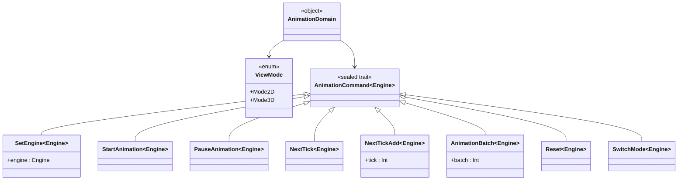

# Design

## Organizzazione del codice

Il codice è organizzato in quattro package principali:

- `domain`: contiene la logica e i concetti fondamentali del sistema
- `state`: si occupa di gestire lo stato dell'applicazione e le sue transizioni
- `view`: gestisce la presentazione dei dati e l'interazione con l'utente
- `api`: contiene le interfacce ed il parser per comunicare con Scastie

A sua volta il package `view` è suddiviso in:

- `components`: contiene componenti grafici riutilizzabili
- `config` : contiene le configurazioni dell'applicazione
- `player`: contiene il player per la gestione del grafo con funzioni di *Play*, *Pausa* e regolazione della velocità ed il controller per interagire con scastie
- `graph`: contiene il visualizzatore 3D del grafo

## Domanin

## State

## View

### Graph

## Api
