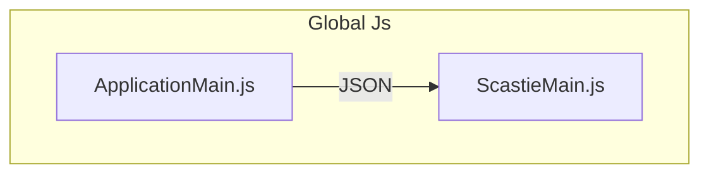

# Implementazione

## Comunicazione Scastie - Applicazione

Il principio fondamentale che regola l'interazione tra Scastie e l'applicazione si basa sul concetto delle facade types di JavaScript. Questi tipi permettono di definire interfacce Scala che corrispondono ai tipi JavaScript, consentendo l'interoperabilità con librerie esterne. Nel dettaglio, il codice compilato da Scastie espone delle API accessibili tramite JavaScript, che vengono utilizzate per interagire con l'applicazione. La comunicazione tra i due avviene attraverso l'uso di js.Dynamic, una funzionalità di Scala.js che consente di interagire con oggetti JavaScript senza una tipizzazione esplicita. Per rappresentare i dati scambiati viene utilizzato il formato JSON.

Questa implementazione presenta sia vantaggi che svantaggi:

- Vantaggi: Il codice di Scastie è completamente indipendente e può essere utilizzato per integrare qualsiasi libreria di aggregate computing, a condizione che rispetti il trait e il formato JSON previsto.
- Svantaggi: L'uso di JSON implica la necessità di effettuare il parsing dei dati, un'operazione che in questo caso può risultare onerosa.
Di seguito è riportato un diagramma Mermaid che illustra l'interazione tra Scastie e l'applicazione:


Testo Riformulato
Il principio fondamentale che regola l'interazione tra Scastie e l'applicazione si basa sul concetto delle facade types di JavaScript. Questi tipi permettono di definire interfacce Scala che corrispondono ai tipi JavaScript, consentendo l'interoperabilità con librerie esterne.

Nel dettaglio, Scastie espone delle API accessibili tramite JavaScript, che vengono utilizzate per interagire con l'applicazione. La comunicazione tra i due avviene attraverso l'uso di js.Dynamic, una funzionalità di Scala.js che consente di interagire con oggetti JavaScript senza una tipizzazione esplicita. Per rappresentare i dati scambiati viene utilizzato il formato JSON.

Questa implementazione presenta sia vantaggi che svantaggi:

Vantaggi: Il codice di Scastie è completamente indipendente e può essere utilizzato per integrare qualsiasi libreria di aggregate computing, a condizione che rispetti il trait e il formato JSON previsto.
Svantaggi: L'uso di JSON implica la necessità di effettuare il parsing dei dati, un'operazione che in questo caso può risultare onerosa.




Come viene importato:
```scala

val engine = js.Dynamic.global.EngineImpl(
  xVar.now(),
  yVar.now(),
  zVar.now(),
  distXVar.now(),
  distYVar.now(),
  distZVar.now(),
  edgeDistVar.now()
)

```

Come viene esportato:

```scala
type Id = Int
type Color = Int
type Label = String

final case class Position(x: Double, y: Double, z: Double)
final case class Node(id: Id, position: Position, label: Label, color: Color)

trait EngineApi:
  def executeIterations(): Unit
  def getNodes(): js.Array[js.Dynamic]
  def getEdges(): js.Array[js.Dynamic]

@JSExportTopLevel("EngineImpl")
case class EngineImpl(ncols: Int, nrows: Int, ndepth: Int)(
  stepx: Int,
  stepy: Int,
  stepz: Int
)(proximityThreshold: Int) extends EngineApi: ...
```
## Domanin
    
```scala
sealed trait GraphType:
  type Id    = Int
  type Color = Int
  type Label = String

object GraphDomain extends GraphType:
  final case class Position(x: Double, y: Double, z: Double)
  final case class GraphNode(
      id: Id,
      position: Position,
      label: Label,
      color: Color
  )
  final case class GraphEdge(nodes: (GraphNode, GraphNode)):
    override def equals(obj: Any): Boolean = obj match
      case that: GraphEdge =>
        this.nodes == that.nodes || this.nodes == that.nodes.swap
      case _ => false

  sealed trait GraphCommand
  case class SetNodes(nodes: Set[GraphNode])        extends GraphCommand
  case class SetEdges(edges: Set[GraphEdge])        extends GraphCommand
  case class SetEdgesByIds(edgesIds: Set[(Id, Id)]) extends GraphCommand

object AnimationDomain:
  enum ViewMode:
    case Mode2D, Mode3D
  sealed trait AnimationCommand[Engine]
  case class SetEngine[Engine](engine: Engine)  extends AnimationCommand[Engine]
  case class StartAnimation[Engine]()           extends AnimationCommand[Engine]
```

### Uso dei Type Alias

Nella parte relativa a GraphType, vengono definiti degli alias (Id, Color, Label) per rappresentare tipi comunemente utilizzati, come Int e String. Questo approccio migliora la leggibilità e l'auto-documentazione del codice, permettendo di distinguere semanticamente i diversi utilizzi di tipi primitivi all'interno del dominio.

### Engine
Nell' AnimationDomain, il tipo generico [Engine] viene introdotto per evitare dipendenze forti con un motore di rendering o un'implementazione specifica. Questo approccio consente al dominio di rimanere indipendente e riutilizzabile con qualsiasi tipo di "engine" che si voglia integrare.

## State

```scala
trait GraphState:
  val nodes: StrictSignal[Set[GraphNode]]
  val edges: StrictSignal[Set[GraphEdge]]
  val commandObserver: Observer[GraphCommand]

object GraphState extends GraphState:
  private val nodesVar: Var[Set[GraphNode]]        = Var(Set.empty[GraphNode])
  private val edgesVar: Var[Set[GraphEdge]]        = Var(Set.empty[GraphEdge])
  override val nodes: StrictSignal[Set[GraphNode]] = nodesVar.signal
  override val edges: StrictSignal[Set[GraphEdge]] = edgesVar.signal

  override val commandObserver: Observer[GraphCommand] =
    Observer[GraphCommand] {

      case SetNodes(newNodes) =>
        nodesVar.set(newNodes)
    
    }

```

Questo codice definisce uno stato reattivo per un grafo, evidenziando come all'esterno sia possibile solo osservare lo stato e inviare comandi per modificarlo.

## Engine Loop
    
```scala
  override def start(): Unit =
    def loop(): Unit =
      if running.now() then
        val batchCount = batch.now()
        for _ <- 1 to batchCount do getEngineOrEmpty.executeIterations()
        animationObserver.onNext(NextTickAdd(batchCount + 1))
        handleNewData(processNextBatch())
        setTimeout(() => loop(), 8)
    loop()
```

## Extension

```scala
object DomainExtensions:
  extension (edge: GraphEdge)
    def object3dName: String =
      val (n1, n2) = edge.nodes
      val (minId, maxId) =
        if n1.id < n2.id then (n1.id, n2.id) else (n2.id, n1.id)
      s"edge-$minId-$maxId-$n1-$n2"

  extension (node: GraphNode)
    def object3dName: String = s"node-${node.id}"
```

## Three.js Types and Adapter

```scala 3
type GenericObject3D = Object3D[Object3DEventMap]
type ThreeGroup      = Group[Object3DEventMap]
type ThreePoints =
  Points[BufferGeometry[Nothing], PointsMaterial, Object3DEventMap]
type ThreeSprite = Sprite[Object3DEventMap]
type ThreeLine =
  Line[BufferGeometry[Nothing], LineBasicMaterial, Object3DEventMap]
type ThreeMesh   = Mesh[BufferGeometry[Nothing], Material, Object3DEventMap]
type ThreeCamera = Camera

object ThreeType:

  def unsafeCast[T](obj: js.Any): T = obj.asInstanceOf[T]
  
  object GenericObject3D:
    def unapply(obj: Object3D[?]): Option[GenericObject3D] =
      Some(obj.asInstanceOf[GenericObject3D])
      
  object ThreeCamera:
    def unapply(cam: PerspectiveCamera): Option[ThreeCamera] = cam.`type` match
      case "PerspectiveCamera" => Some(cam.asInstanceOf[ThreeCamera])
      case "Camera"            => Some(cam.asInstanceOf[ThreeCamera])
      case _                   => None

  object Group:
    def unapply(obj: GenericObject3D): Option[ThreeGroup] = obj.`type` match
      case "Group" => Some(obj.asInstanceOf[ThreeGroup])
      case _       => None

  object Line:
    def unapply(obj: GenericObject3D): Option[ThreeLine] = obj.`type` match
      case "Line" => Some(obj.asInstanceOf[ThreeLine])
      case _      => None
```

```scala
def removeObject(obj: GenericObject3D): Unit =
      import ThreeType._
      obj match
        case Group(group) =>
          for
            child <- group.children
            _ <- child match
              case Line(line) =>
                line.geometry.dispose()
                line.material.dispose()
                underlying.remove(line)
              case Points(points) =>
                points.geometry.dispose()
                points.material.dispose()
                underlying.remove(points)
              case Sprite(sprite) =>
                sprite.geometry.dispose()
                sprite.material.dispose()
                sprite.material.map.dispose()
                underlying.remove(sprite)
              case _ => ()
          do underlying.remove(group)
        case _ => ()
```

## Laminar View

```scala
def render(): Unit =
    val rootElement = div(
      scene.renderScene("three_canvas"),
      sceneController.render,
      animationController.render,
      engineSettings.render,
      running --> {
        case true => player.start()
        case _    => ()
      },
      engine --> {
        case Some(engine) => player.loadNextFrame()
        case _            => ()
      },
      edges.combineWith(nodes) --> {
        case (edges, nodes) =>
          scene.setNodes(nodes)
          scene.setEdges(edges)
      },
      onMountCallback(_ => initialize())
    )
```

