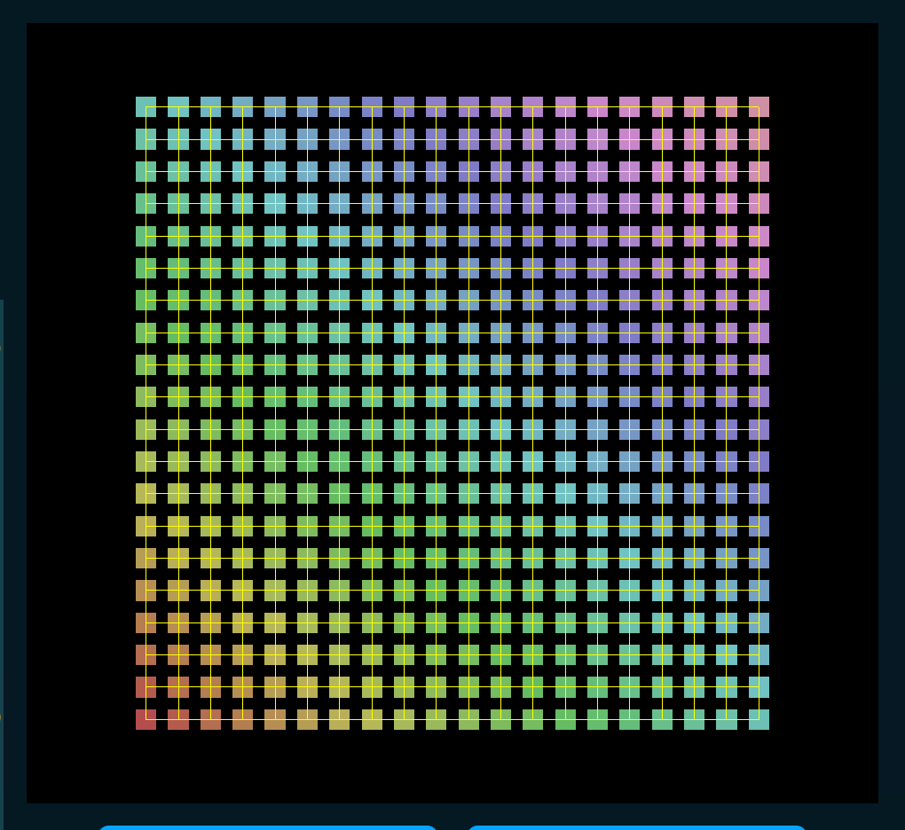

# Scafi Web 3D

## How to run the project

1. `git clone https://github.com/Ro0t-set/PPS-25-ScafiWeb3.git`
2. `cd PPS-25-ScafiWeb3`
3. `npm install`
4. `sbt fastLinkJS`
5. `npm run dev`
6. Open your browser at `http://localhost:8080`

## sbt Tests

- `sbt test`
- `sbt cucumber -DtestEnv=[local, ci] -Dbrowser=[edge, firefox, chrome]` (Default is ci and firefox)
- `sbt cucumberWithServer` (ci and firefox)

## npm Commands

- `npm install`
- `npm run dev`
- `npm run build`
- `npm run docs:dev`
- `npm run docs:build`

## Example Photos

