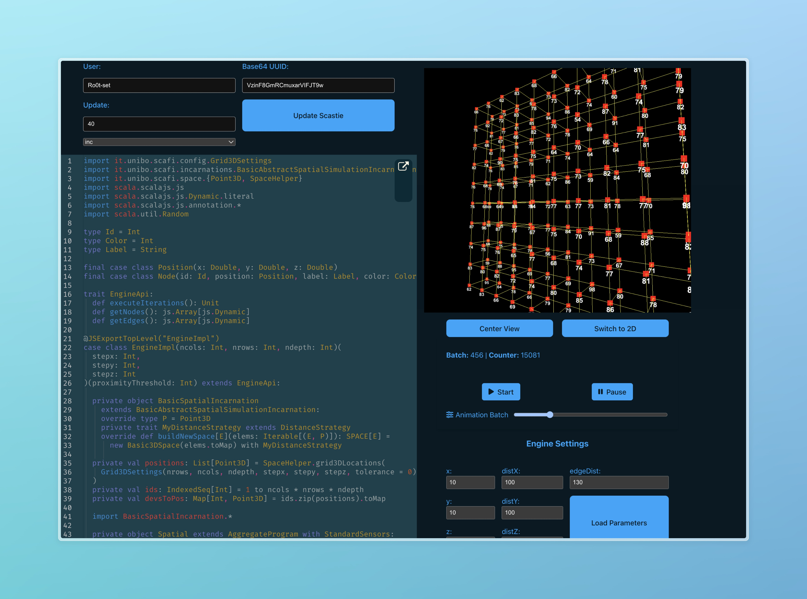

# Scafi Web 3D


Con questo progetto si pone l' obiettivo di avere in grado di facilitare lo sviluppo di applicazioni distribuite basate. Le due principali funzionalità offerte sono la visualizzazione di un ambiente 3D e la possibilità di scrivere e compilare codice runtime. L'implementazione è stata fortemente vincolata dall'uso di Scastie, che è un servizio online che permette di scrivere e compilare codice Scala in tempo reale.

## How to run the project

```bash
git clone https://github.com/Ro0t-set/PPS-24-ScafiWeb3.git
cd PPS-24-ScafiWeb3
cd js && npm install
cd ..
npm install
sbt fastLinkJS
npm run dev
```

## sbt Tests

- `sbt test`
- `sbt cucumber -DtestEnv=<local, ci> -Dbrowser=<edge, firefox, chrome>` (Default is ci and firefox)
- `sbt cucumberWithServer` (ci and firefox)

## npm Commands

- `npm install`
- `npm run dev`
- `npm run build`
- `npm run docs:dev`
- `npm run docs:build`

## Example Code

[Git repo](https://github.com/Ro0t-set/Scafi3DScastieExamples.git)

## Example Photos




